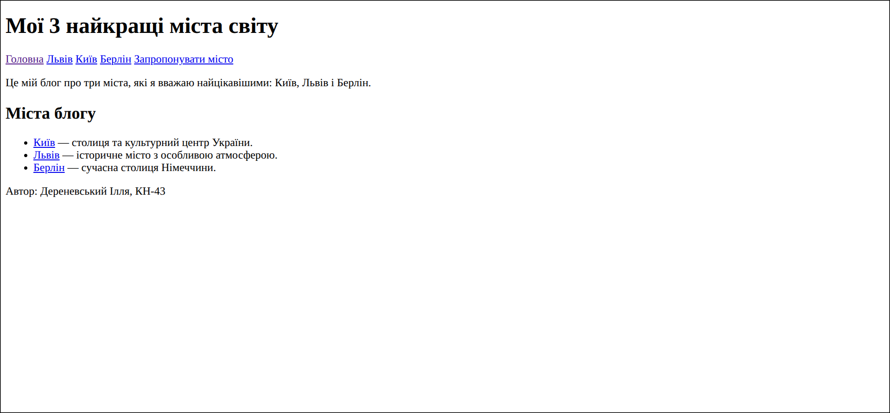

# Звіт до лабораторної роботи №1

## Тема
**Назва лабораторної роботи:** Імплементація статичного web-блогу «Мої 3 найкращі міста світу» з використанням семантичної HTML-розмітки, організація проєкту в Git-репозиторії, розміщення на GitHub і розгортання за допомогою GitHub Pages.

## Мета роботи
Набути практичних навичок проєктування та реалізації багатосторінкового статичного вебсайту, його версіювання та публікації в Інтернеті.

## Виконання роботи
- створено багатосторінковий блог про Київ, Львів і Берлін;
- використано семантичні HTML-елементи, відносні посилання та зображення;
- реалізовано навігацію між сторінками міст;
- додано форму пропозиції нового міста.

## Результат
Опублікована сторінка: [Переглянути лабораторну роботу №1](https://illiaderenevskyi.github.io/lab_web/lab1/index.html)

## Висновок
Під час роботи закріплено навички створення семантичного багатосторінкового сайту, роботи з відносними шляхами та формами. Також опрацьовано версіювання проєкту й публікацію через GitHub Pages.
