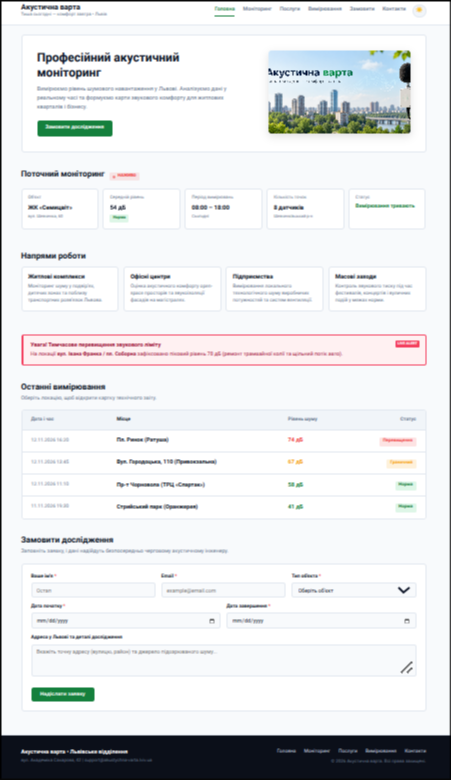

# Звіт до лабораторної роботи №2

## Тема
**Назва лабораторної роботи:** Верстка сайту компанії згідно з інструкцією (HTML/CSS).

## Мета роботи
Практично застосувати CSS для оформлення семантичної HTML-структури вебсторінки: підключення зовнішніх стилів, селектори, каскад і специфічність, типи блоків та Box Model.

## Виконання роботи
- створено сторінку сервісу моніторингу шуму «Акустична варта»;
- використано окремий CSS-файл, селектори різних типів і правила каскаду;
- продемонстровано `display: block`, `inline` та `inline-block`, а також позиціювання елементів;
- реалізовано блоки моніторингу, послуг і таблицю вимірювань;
- додано модальні звіти, форму заявки та перемикач теми.

## Результат
Опублікована сторінка: [Переглянути лабораторну роботу №2](https://illiaderenevskyi.github.io/lab_web/lab2/index.html)

## Висновок
Під час роботи закріплено навички підключення зовнішнього CSS та оформлення семантичної HTML-сторінки. На практиці застосовано селектори, каскад, Box Model і властивості відображення елементів.
