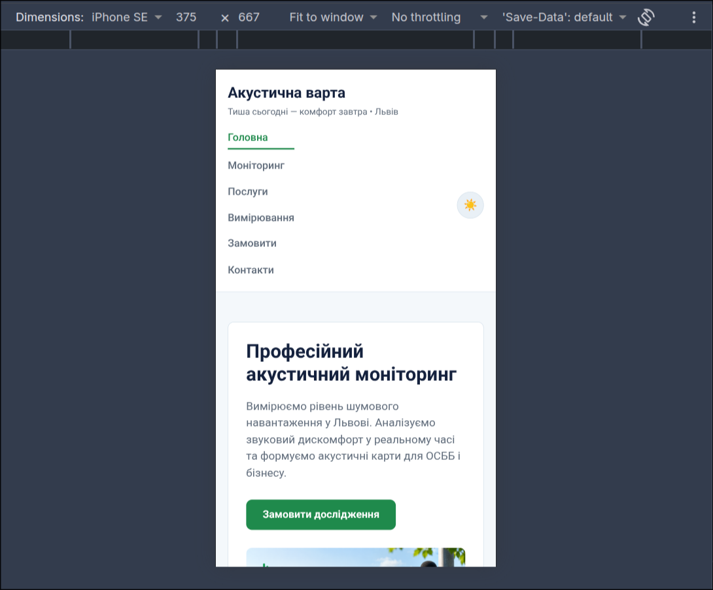

# Звіт до лабораторної роботи №3

## Тема
**Назва лабораторної роботи:** Адаптивна верстка вебсторінки за допомогою Flexbox, CSS Grid та препроцесора SCSS.

## Мета роботи
Набути практичних навичок перетворення HTML/CSS-сторінки на адаптивний інтерфейс із використанням SCSS, медіазапитів, Flexbox і CSS Grid та вдосконалити проєкт «Акустична варта» за принципами responsive design.

## Виконання роботи
- перенесено стилі проєкту до модульної структури SCSS;
- використано змінні, mixins, вкладені правила та модулі Sass;
- реалізовано компонування за допомогою Flexbox і CSS Grid;
- адаптовано навігацію, секції, картки й таблицю для різних розмірів екрана.

## Результат
Опублікована сторінка: [Переглянути лабораторну роботу №3](https://illiaderenevskyi.github.io/lab_web/lab3/index.html)

## Висновок
Під час роботи закріплено навички модульної організації SCSS та створення адаптивних макетів. Опрацьовано використання Flexbox, Grid і медіазапитів для зручного відображення сторінки на різних пристроях.
