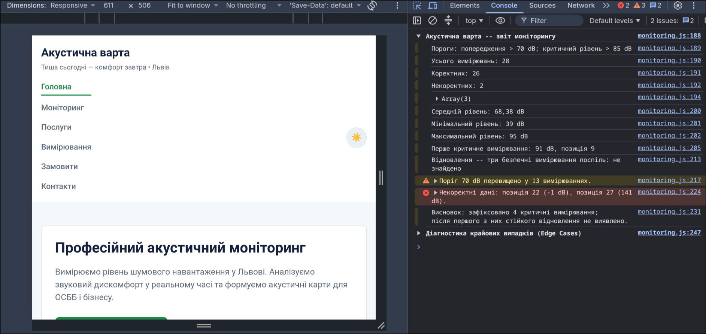

# Звіт до лабораторної роботи №4

## Тема
**Назва лабораторної роботи:** Робота з циклами, функціями та функціональними виразами в JavaScript. Консоль браузера.

## Мета роботи
Реалізувати й пояснити алгоритм аналізу послідовності вимірювань: від перевірки даних і циклів до декомпозиції на функції та синхронної передачі функції як аргументу.

## Виконання роботи
- створено зовнішній JavaScript-файл для аналізу рівнів шуму;
- використано цикли для перевірки, класифікації та підрахунку вимірювань;
- реалізовано функції пошуку критичних показників, обчислення метрик і відновлення безпечного рівня;
- сформовано звіт у консолі браузера з категоріями вимірювань і некоректними значеннями.

## Результат
Опублікована сторінка: [Переглянути лабораторну роботу №4](https://illiaderenevskyi.github.io/lab_web/lab4/index.html)

## Висновок
Під час роботи закріплено навички перевірки даних, роботи з циклами й написання функцій у JavaScript. Також опрацьовано передачу функції як аргументу та перевірку результату через консоль браузера.
