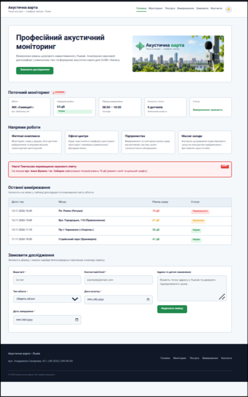

# Звіт до лабораторної роботи №5

## Тема
**Назва лабораторної роботи:** Проєктування системи класів у JavaScript на прикладі навчального вебпроєкту «Акустична варта».

## Мета роботи
Навчитися переходити від окремих об’єктів і функцій до системи взаємопов’язаних класів: визначати стан і поведінку сутностей, розподіляти відповідальності, застосовувати композицію та наслідування й інтегрувати об’єктну модель у вебпроєкт.

## Виконання роботи
- реалізовано класи `NoiseSensor`, `NoiseMeasurement` і `MonitoringSystem`;
- централізовано пороги класифікації шуму та додано перевірку вимірювань;
- реалізовано пошук, фільтрацію й обчислення середнього рівня шуму для сенсорів;
- додано підклас мобільного датчика та відображення сенсорів у картках сторінки.

## Результат
Опублікована сторінка: [Переглянути лабораторну роботу №5](https://illiaderenevskyi.github.io/lab_web/lab5/index.html)

## Висновок
Під час роботи закріплено навички проєктування класів і розподілу відповідальностей між моделлю та інтерфейсом. Реалізовано композицію сенсорів і вимірювань, наслідування та роботу з колекцією об’єктів.